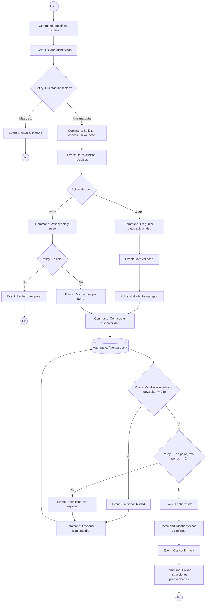

# Event Storming - Flujo de reserva de esterilizacion

## Leyenda
- **Command:** accion solicitada por usuario o sistema.
- **Event:** hecho ocurrido y registrado por el flujo.
- **Policy:** regla de decision del negocio.
- **Aggregate/Data:** estado de agenda o entidad relevante.

## Diagrama Mermaid

## Resumen numerado del flujo
1. Se identifica al usuario y se valida si gestiona una o varias mascotas.
2. Si hay multiples mascotas, se deriva a llamada por complejidad operativa.
3. Se solicitan datos clinicos minimos para clasificar el servicio.
4. Se calcula tiempo quirurgico segun especie, sexo y peso.
5. Se valida disponibilidad por capacidad diaria y restriccion por especie.
6. Si no hay hueco valido, se propone siguiente dia.
7. Si hay disponibilidad, se confirma fecha y se envian instrucciones.
